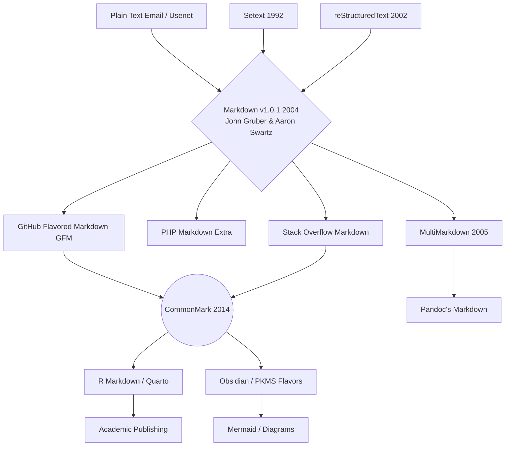
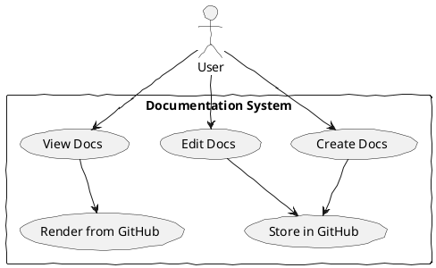

[__TOC__]


[Markdown Test Sample](Markdown-IT.md)

## Goal
- About to start a project to evaluate the different documentation systems that are available for software architecture. The goal is to find the best fit for our team's needs.
- To alow architects to write their documenation using their own favorite tools. Whether it's markdown, reStructuredText, or even plain text files.
- Need to all use the same git storage system to keep everything organized and version controlled.
- Will need to support different diagramming tools as well. Some architects prefer using PlantUML, mermaid, structurizr, or even visio.
- Will need to create templates and guidelines to ensure consistency across all documentation.
- Pricing

The various documentation platforms can be broadly categorized into two main types based on their architecture and workflow:
- [Static Site Generators (Docs-as-Code)](#static-site-generators-docs-as-code)
- [Integrated Solutions (SaaS with GitHub Sync)](#integrated-solutions-saas-with-github-sync)

## Documentation tools and platforms to consider:
  - [GitHub Pages](https://docs.github.com/en/pages)
  - [MkDocs](https://www.mkdocs.org/)
  - Azure Devops Wiki 
  - [Docusaurus](https://docusaurus.io/)
  - [Quarto](https://newportg.github.io/POC-DocumentationWiki-Quarto/)
  - [GitBook](https://www.gitbook.com/)
  - [Document360](https://document360.com/)
  - [Read The Docs](https://about.readthedocs.com/) 
  - [Confluense](https://www.atlassian.com/software/confluence)
  - [Notion](https://www.notion.com/)


## Static Site Generators (Docs-as-Code) 
These tools generate a website from plain-text files stored in your GitHub repository. The documentation lives alongside your code, and the entire software development workflow (pull requests, versioning, code reviews) is used for the documentation as well. 

| Tool       | Description |
|------------|-------------|
| Github Pages (This Site)| Jekyll one of the original static site generators, powered by Ruby. It is the engine behind GitHub Pages, making it a seamless option for hosting your documentation directly from your GitHub repo for free. |
| MkDocs| A fast and simple static site generator written in Python, geared towards technical documentation. It uses Markdown source files and has a variety of themes and plugins available.|
| Docusaurus| An open-source static site generator built on React that is popular for documentation sites. It is easy to use and provides a modern look and feel with built-in search and versioning features.|
| [Quarto](https://newportg.github.io/POC-DocumentationWiki-Quarto/)| An open-source scientific and technical publishing system that allows you to create dynamic content using Markdown and integrate executable code (Python, R, Julia, etc.) into your documentation.|
| DocFX| A static site generator for building and publishing API documentation for .NET projects, but can also be used for general Markdown documentation. It's developed by Microsoft and is highly customizable.|

## Integrated Solutions (SaaS with GitHub Sync)
If you prefer a hosted solution with a more traditional editing interface but still want your source content in GitHub, some SaaS products offer synchronization.

| Tool       | Description |
|------------|-------------|
| GitBook | A modern platform for creating and managing documentation. It can connect to your GitHub repository and automatically sync content, providing a polished user interface while keeping the source in Git.|
| [Document360](Document360.md) | A knowledge base platform that offers GitHub integration for one-way sync of Markdown files from a GitHub repository into Document360. The synced articles are read-only within Document360's editor; any changes must be made in the source GitHub repository and then synced back.|
| Notion or Confluence (with integration)| While their primary storage isn't Git, they can be integrated or used in conjunction with a docs-as-code approach to serve different audiences, with the source of truth remaining in the GitHub repo. |

The "docs-as-code" approach using a static site generator and plain text files is generally considered best practice for software architecture documentation because it aligns with engineering workflows and facilitates version control and collaboration within the existing toolset. 

## Required Diagramming and Modeling Tools (Diagrams-as-Code)
Architecture documentation often requires diagrams. These tools allow you to define diagrams using text-based syntax, which can be versioned in Git like the rest of your documentation. 

| Tool       | Description |
|------------|-------------|
| PlantUML and Mermaid| These tools render simple text-based descriptions into diagrams (UML, C4 model, flowcharts, etc.). GitHub natively supports rendering Mermaid diagrams inline within Markdown files, which is a significant advantage.|
| Structurizr | This tool is based on the C4 model for visualizing software architecture. It allows you to create diagrams and documentation from a single model using code or a Domain Specific Language (DSL), perfect for technical people who want to manage architecture rigorously in source control.|
| Draw.io (now diagrams.net)| While it has a traditional UI editor, it also offers a C4 model plugin and can store diagram definitions in a version-control-friendly format (like XML or text) within your GitHub repo. |
  

Given this list of documentation platforms.

  - [GitHub Pages](https://docs.github.com/en/pages)
  - Azure Devops Wiki 
  - [Docusaurus](https://docusaurus.io/)
  - [GitBook](https://www.gitbook.com/)
  - [Document360](https://document360.com/)
  - [Read The Docs](https://about.readthedocs.com/) 
  - [Quarto](https://newportg.github.io/POC-DocumentationWiki-Quarto/)
  - [Confluense](https://www.atlassian.com/software/confluence)
  - [Notion](https://www.notion.com/)
  - [MkDocs](https://www.mkdocs.org/)

which best meet our requirements of:

- 20 active contributing users
- 1000+ readonly users
- Github backed document repository
- Support for Markdown
- Support for Plantuml, Mermaid, Stucturizr

The best options that meet all requirements, especially the GitHub-backed document repository, are the open-source static site generators such as Docusaurus, MkDocs, Quarto, and GitHub Pages. These platforms fully support the "docs-as-code" workflow required by a GitHub-backed repository.
Here is a breakdown of why these are the top choices and how they meet your needs:

- GitHub-backed document repository: All these tools use plain Markdown files stored in your GitHub repo as the source of truth.
- 20 active contributing users: The contribution model leverages standard Git workflows (pull requests, branching, code reviews), which scales well for active engineering teams.
- 1000+ readonly users: Static site generators produce highly performant, scalable websites that can handle thousands of concurrent read-only users without performance issues.
- Support for Markdown: Markdown is the native authoring format for all of them.
- Support for PlantUML, Mermaid, Structurizr: Mermaid is natively supported by GitHub and many of these generators. PlantUML and Structurizr are also widely supported through extensions, plugins, or pre-processing during the build pipeline. 

## Recommended Platforms (Best fit, No particular order)

|Platform| 	Notes|
|---|---|
|Docusaurus	|Excellent balance of modern design, ease of use, built-in features (search, versioning), and a React-based structure for customization.|
|MkDocs	|Simple, fast, and highly effective for technical documentation, using Python. Easy to configure plugins for diagram support.|
| [Quarto](https://newportg.github.io/POC-DocumentationWiki-Quarto/)	|Ideal for technical and scientific documentation, integrating executable code and advanced formatting capabilities.|
|GitHub Pages (This Site)	|The underlying hosting platform for the others (often used with Jekyll or MkDocs), offering a seamless, free hosting solution directly from your repo.|

### Why Other Options Are Less Suitable

| Platform| 	Notes|
|---|---|   
| Azure DevOps Wiki | Its primary storage is not a GitHub repo (it uses an Azure repo for "code wiki"), and native support for all diagram types (especially PlantUML and Structurizr) is limited without workarounds.|
| Confluence & Notion | These are traditional CMS/wiki platforms where the primary storage is their own database, not your GitHub repo. While integrations exist, they often rely on one-way syncs or embedding, which doesn't fully align with the "GitHub-backed" requirement.|
| Document360 & GitBook | These are SaaS products. GitBook started with open-source roots but now operates as a hosted solution with sync capabilities. Document360 offers a one-way sync from GitHub, but the source of truth within the app is its own database.|
| Read The Docs | Excellent for hosting documentation, particularly Sphinx projects, but often used for existing projects rather than a standalone platform choice like Docusaurus or MkDocs for greenfield projects. It still fits the requirements as a hosting solution for content from a GitHub repo. |

## MarkDown Versions

[Markdown Test Sample](Markdown-IT.md)

The best fit version applications use the following versions of Markdown.

- Docusaurus uses MDX by default, which is a superset of GitHub Flavored Markdown (GFM) that allows you to embed JSX (React components) within your Markdown content. It can be configured to use a stricter CommonMark format if needed.
- MkDocs uses the Python-Markdown library, which is nearly completely compliant with the original Markdown reference implementation. It gains additional features, including support for diagrams and other advanced syntax, through extensions.
- Quarto is based on Pandoc Markdown, an extended and slightly revised version of John Gruber's original Markdown syntax. Pandoc Markdown is a highly flexible and powerful superset that adds features necessary for technical and academic publishing, such as citations, cross-references, and definition lists.
- GitHub Pages uses GitHub Flavored Markdown (GFM) as its default, which is a formal specification based on the CommonMark standard. GFM is a strict superset of CommonMark, adding useful extensions like tables, strikethrough, task lists, and automatic linking of URLs and GitHub-specific references (issues, commits, users). 

In summary, all four options are either based on the highly compatible CommonMark or GFM specifications, ensuring that your documentation is largely portable and readable across different platforms.

### Genealogy of Markdown



## Diagramming Support

| Documentation Tool | Mermaid |Plantuml | Structurizr |
|--------------------|---------|---------|-------------|
| Docusaurus        | Yes (native support) | Yes (via plugins) | Yes (via plugins) |
| MkDocs            | Yes (via plugins)    | Yes (via plugins) | Yes (via plugins) |
| Quarto            | Yes (native support) | Yes (via plugins) | No (requires pre-generation) |
| GitHub Pages      | Yes (native support) | No (requires pre-generation) | No (requires pre-generation) |


Representing PlantUML and Structurizr diagrams in the recommended applications is generally achieved using plugins, extensions, or by generating images as part of your build pipeline. Since these tools use static site generation, the diagrams are typically converted to SVG or PNG images at build time rather than rendered dynamically in the browser.

### Docusaurus
Docusaurus natively supports Mermaid, but PlantUML and Structurizr require community plugins or build-time generation. 

- PlantUML: Use a plugin like remark-kroki or similar Docusaurus PlantUML plugins that convert plantuml code blocks to images during the build process, often using a public or private PlantUML server.
- Structurizr: A dedicated docusaurus-plugin-structurizr exists to generate diagrams from Structurizr DSL files (.dsl) and embed them into your markdown pages.
- Mermaid: Docusaurus has native support for Mermaid via a simple configuration in docusaurus.config.js, making it a very seamless option. 

### MkDocs
MkDocs has a rich ecosystem of plugins that handle diagram generation effectively.

- PlantUML: The mkdocs-plantuml-plugin is widely used. It requires a PlantUML server (which you can run locally via Docker) to render diagrams from puml code blocks in your markdown files during the build phase.
- Structurizr: You can use the Structurizr CLI to generate PlantUML files from your DSL, and then use the PlantUML plugin to render those. Alternatively, you can use the mkdocs-kroki-plugin which supports Structurizr DSL directly.
- Mermaid: The Material for MkDocs theme has first-class support for Mermaid and other diagram libraries via its integration with the Kroki service. 

### GitHub Pages
GitHub Pages uses Jekyll by default, and its capabilities are dependent on the plugins GitHub allows to run in its environment.

- Mermaid: GitHub added native support for rendering Mermaid diagrams in Markdown files, which works seamlessly on GitHub Pages.
- PlantUML & Structurizr: GitHub Pages runs in "safe mode", which restricts custom plugins. To use PlantUML or Structurizr with GitHub Pages, you must generate the SVG/PNG image files as part of your CI/CD pipeline (e.g., using GitHub Actions) and commit those images to your repository. You then reference the generated image files in your Markdown using standard image syntax . You cannot render them live within the Markdown source blocks on the GitHub Pages server itself.

## Demo Rendered Sites
* [GitHub Pages](https://newportg.github.io/POC-DocumentationWiki/README.html)
* [GitBook](https://zoomalong.gitbook.io/poc-documentation/)
* [Quarto](https://newportg.github.io/POC-DocumentationWiki-Quarto/)




```structurizr
workspace {
    model {
        user = person "User" {
            description "A user of the documentation system."
        }

        documentationSystem = softwareSystem "Documentation System" {
            description "A system for creating, editing, and viewing documentation."

            createDocs = container "Create Docs" {
                description "Allows users to create new documentation."
            }

            editDocs = container "Edit Docs" {
                description "Allows users to edit existing documentation."
            }

            viewDocs = container "View Docs" {
                description "Allows users to view documentation."
            }

            storeInGitHub = container "Store in GitHub" {
                description "Stores documentation in a GitHub repository."
            }

            renderFromGitHub = container "Render from GitHub" {
                description "Renders documentation from the GitHub repository."
            }
        }

        user -> createDocs "Creates documentation"
        user -> editDocs "Edits documentation"
        user -> viewDocs "Views documentation"
        createDocs -> storeInGitHub "Stores in"
        editDocs -> storeInGitHub "Stores in"
        viewDocs -> renderFromGitHub "Renders from"
    }

    views {
        systemContext documentationSystem {
            include *
            autolayout lr
        }

        container documentationSystem {
            include *
            autolayout lr
        }
    }
}
``` 
